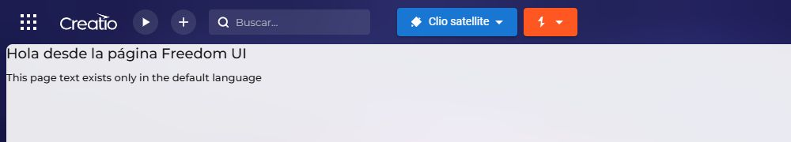

# Creatio localization lab

This lab is a complete Clio workspace that demonstrates schema-owned localizable values in Creatio backend code and Freedom UI.

The workspace, application package, and test project were created from the workspace root with:

```powershell
clio createw creatio-localization-lab --empty --directory C:\Projects
clio ap AtfLocalizationLab -a
clio unit-test --package AtfLocalizationLab
clio dconf -e <environment>
```

`MainSolution.slnx` contains both the package project and its unit-test project. `clio dconf` downloads the Creatio assemblies required by both projects into the ignored `.application` directory.

The verified acceptance path targets Creatio .NET 8 with the `dev-n8` configuration. The workspace and application descriptors use Creatio 8.3.3 as the supported baseline; the live evidence was collected on Creatio 10.1.585.0.

## Ownership rule

Put a localizable value on the schema that renders or consumes it:

- `UsrAtfLocalizationLabMessages` is a source-code schema for backend values that have no more natural owner.
- `UsrAtfLocalizationLabPage` owns the values rendered by that Freedom UI page.

The backend schema is not a package-wide localization registry. Page, process, object, and other schema-specific values belong to their respective schemas.

Persisted resource item names use `LocalizableStrings.<Key>.Value`. Register normal backend strings in
the source-code schema's `B2` collection as well as its resource XML, so developers can discover and
edit them in the designer. Freedom UI metadata declares each localizable value and the page binds it
as `$Resources.Strings.<Key>`.

## Backend designer registration

`SharedGreeting` and `DefaultOnly` are the normal backend examples. Each has a stable `UId` and an
entry in `Schemas/UsrAtfLocalizationLabMessages/metadata.json` under `MetaData.Schema.B2`:

```json
{
  "UId": "49c56e04-61b2-4fbc-8261-64e881b605a1",
  "A2": "SharedGreeting",
  "A3": "0e340e9b-6657-44da-8f3a-a29ea6344519",
  "A4": "0e340e9b-6657-44da-8f3a-a29ea6344519",
  "A5": "d6014583-bb03-43a0-a62f-b3185a12ef04"
}
```

`A2` is the key, `A3`/`A4` identify its creating/modifying schemas, and `A5` identifies its originating
package. These two schema IDs coincide for these newly declared items; preserve inherited item
identities when working with replacement schemas. Text belongs in `resource.en-US.xml` and
`resource.es-ES.xml`, not in this metadata entry. The schema owns resources without needing an empty
CLR class in its C# body.

Open the `UsrAtfLocalizationLabMessages` source-code schema in Configuration and inspect **Localizable
strings**. Both normal keys must be visible. Save and reopen the schema, then verify English/Spanish
values and the intentional Spanish omission for `DefaultOnly`. A backend lookup alone is not proof
of designer integration.

The extra `RegisteredProbe`, `XmlOnlyProbe`, and `MetadataOnlyProbe` keys are **diagnostics**, not
recommended application patterns. They distinguish declarations from resource storage:

| Diagnostic | Backend lookup | Designer |
| --- | --- | --- |
| B2 + XML | Translated value | Listed with values |
| XML only | Translated value | Not listed |
| B2 only | null | Listed without values |

Do not use `XmlOnlyProbe` as a template for normal strings. Its deliberately incomplete declaration
tests a platform boundary; preservation through designer editing is not its contract.

## Backend abstraction and web-service boundary

Application code depends on `ILocalizableStringResolver`, not directly on Creatio Core's concrete `LocalizableString` class. `LocalizableStringResolver` is the single adapter that constructs `LocalizableString` and exposes current-culture, strict-culture, and fallback operations. The interface and implementation are kept together in `LocalizableStringResolver.cs` so this small teaching example is easy to navigate. The lab-specific interface and implementation are likewise kept together in `LocalizationLabService.cs`. The application composition root registers both pairs for dependency injection.

`AtfLocalizationLabService` is only a transport entry point. It:

1. validates the concrete request DTO and culture;
2. opens an application scope;
3. resolves the lab domain service `ILocalizationLabService`;
4. delegates once;
5. maps the domain result to a concrete response DTO.

The web service contains no localization logic and never constructs `LocalizableString`.

## What the lab proves

English (`en-US`) is the default language and Spanish (`es-ES`) is the secondary language. The examples cover:

- a value translated in both languages;
- a value present only in the default language;
- a missing key;
- strict lookup with `GetCultureValue`;
- fallback lookup with `GetCultureValueWithFallback`;
- current-culture lookup with `Value`;
- Freedom UI resource resolution.

## Build and run tests

Run all commands from the workspace root.

```powershell
clio dconf -e <environment>
dotnet build .\MainSolution.slnx -c dev-n8
dotnet test .\tests\AtfLocalizationLab\AtfLocalizationLab.Tests.csproj -c dev-n8 --filter "Category=ResourceContent"
dotnet test .\tests\AtfLocalizationLab\AtfLocalizationLab.Tests.csproj -c dev-n8 --filter "Category=Implementation"
dotnet test .\tests\AtfLocalizationLab\AtfLocalizationLab.Tests.csproj -c dev-n8 --filter "Category!=Creatio" /p:CollectCoverage=true
```

`ResourceContent` tests inspect schema ownership, resource keys, metadata, bindings, and deliberate fallback cases. `Implementation` tests execute the resolver adapter, domain service, application composition root, and thin web-service boundary. `LocalizableStringResolverTests` demonstrates how to mock Creatio's `IResourceStorage` and `IResourceManager` while testing the concrete adapter.

The resolver assigns each platform result to a local variable before returning it. This keeps the generated example easy to debug without changing the optimized runtime behavior.

The coverage command runs both stand-free categories and enforces 100% line, branch, and method coverage for the production package assembly. The thresholds live in the test project, so a regression fails the command instead of merely producing a lower report.

For live tests, synchronize the package into an exclusively owned development environment, compile the configuration, and set the environment name:

```powershell
clio link-from-repository -e <environment> --repoPath .\packages --packages AtfLocalizationLab
clio unlock-package AtfLocalizationLab -e <environment>
clio pkg-to-db -e <environment>
clio compile-configuration -e <environment>
clio restart-web-app -e <environment> --wait-ready
clio clear-redis-db -e <environment>
$env:CLIO_ENVIRONMENT = "<environment>"
dotnet test .\tests\AtfLocalizationLab\AtfLocalizationLab.Tests.csproj -c dev-n8 --filter "Category=Creatio"
```

On a fresh instance, activate Spanish (`es-ES`) in Languages before synchronizing the resources.
For a new package that does not yet exist remotely, add `--skip-preparation` to the initial link
command, synchronize it, then unlock it. The live category includes a native designer save/readback
test and must run only against an exclusive, writable lab. A successful compile does not prove that
new resources are loaded: assert distinct runtime values and follow the restart step when stale.

See [backend metadata validation](docs/localizable-metadata-validation.md) for tested boundaries.

## Freedom UI result

Open the deployed page at `Shell/#Page/UsrAtfLocalizationLabPage`.

English:


Spanish shows the translated greeting and default-language fallback for the untranslated value:



## Relevant files

- `packages/AtfLocalizationLab/Schemas/UsrAtfLocalizationLabMessages`
- `packages/AtfLocalizationLab/Resources/UsrAtfLocalizationLabMessages.SourceCode`
- `packages/AtfLocalizationLab/Schemas/UsrAtfLocalizationLabPage`
- `packages/AtfLocalizationLab/Resources/UsrAtfLocalizationLabPage.ClientUnit`
- `packages/AtfLocalizationLab/Files/src/cs/LocalizableStrings/LocalizableStringResolver.cs`
- `packages/AtfLocalizationLab/Files/src/cs/LocalizableStrings/LocalizationLabService.cs`
- `packages/AtfLocalizationLab/Files/src/cs/EntryPoints/WebServices/AtfLocalizationLabService.cs`
- `tests/AtfLocalizationLab/LocalizableStrings/LocalizableStringResolverTests.cs`
- `tests/AtfLocalizationLab`

The service is test-only. Application code should resolve values where they are consumed and choose strict or fallback behavior intentionally.
